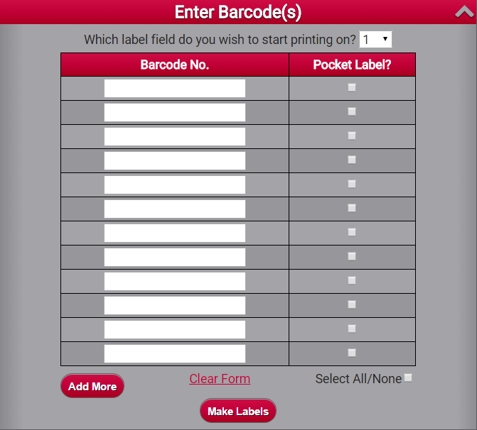
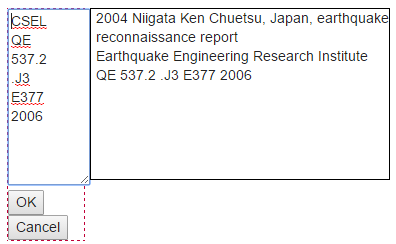

WMS-Labeling
============

Custom application to add label printing capabilities to OCLC's WMS system.



Installation
------------

Clone this repository into your web directory ("git clone {url} labeling") or download directly from GitHub.  Install [TCPDF][1] inside /labeling (e.g., if WMS-Labeling is at /www/labeling then tcpdf should be at /www/labeling/tcpdf).

Copy config/config.php.template to config/config.php. Open config/config.php and add your [OCLC WSKey][2] credentials.

Copy config/crosswalks.php.example to config/crosswalks.php. Open config/crosswalks.php to map shelving locations to desired call number prefixes (e.g., Reference should print as REF on your label).

Copy scripts/laser.config.sample.php to any scripts/{name}.config.php (Default: laser.config.php). Edit desired margins/spacing and settings for your label printer stock. **Note:** If you add label style
files aside from "laser.config.php", you will need to add extra radio inputs in inc/fetch_labels.php. Search for ```<div class="print-area">``` and add to the inputs below it.

Print/edit a single label
-------------------------

Launch yoursite.com/labeling and scan in a barcode and indicate whether a pocket label is desired. Click the "Make Labels" button.

In the preview screen, click anywhere on the call number to edit it if needed. Make your changes and click OK.



Select "Laser Printer" or any other config that you've added. Click "Print Labels". A PDF will be generated. Press Ctrl + P to send the PDF to your printer.

Print labels in a batch
-----------------------

After scanning a barcode, hit Enter on your keyboard, or press "Add More" button at the bottom of the screen to add multiple barcodes. The maximum labels per page is set in the config/{name}.config.php file.

[1]: http://www.tcpdf.org/installation.php  
[2]: http://oclc.org/developer/develop/authentication/how-to-request-a-wskey.en.html
